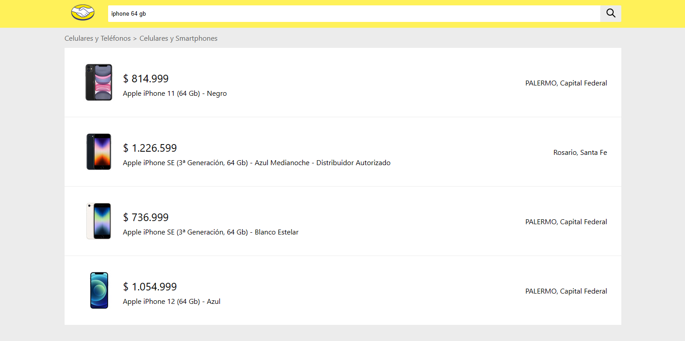

# Challenge técnico Front End - Mercado Libre

Aplicación para búsqueda de artículos de Mercado Libre, la cual permite listar los resultados obtenidos y la navegación hacia el detalle de cada uno de ellos.



## Estructura de proyecto

El proyecto está dividido en dos carpetas:
- **/client/:**  Aplicación Front End construida en React.js, utilizando Vite como entorno de desarrollo.
- **/server/:** Aplicación Back End construida en Express.js.

## Tecnologías principales

- React v18.2.0
- React Router DOM v6.17.0
- Sass v1.69.4
- Node v18.16.0
- Express v4.18.2

## Variables de entorno

El proyecto dispone de las siguientes variables de entorno definidas

Servidor:
- `MERCADOLIBRE_API`=https://api.mercadolibre.com
- `PORT`=3000

## Puertos
- Cliente: la aplicación utiliza el puerto `5173`
- Servidor: la aplicación utiliza el puerto indicado en el archivo `.env`, o ,por defecto, el puerto `3000`

*Importante: En desarrollo, el cliente se comunica con el servidor a través de un proxy, por lo que es importante verificar que el mismo apunte al puerto correcto en caso de cambiar el puerto del servidor. Para ello, revisar el archivo `/client/vite.config.js:19`*

## Instalación y ejecución

1.- Clonar el repositorio

```bash
  git clone https://github.com/mlrosas21/meli-challenge-fe
```

2.- Ubicado en la carpeta raíz, ejecutar el siguiente comando para instalar las dependencias de todo el proyecto:

```bash
  npm install
```

3.- Ejecutamos ambas aplicaciones mediante el siguiente comando:

```bash
  npm start
```

## Pruebas unitarias

Ubicandose en la carpeta raíz del proyecto, ejecutar el siguiente comando para correr las pruebas unitarias de la aplicación de React:

```bash
  npm test
```

## Autores

- Martín Rosas [@mlrosas21](https://github.com/mlrosas21)
